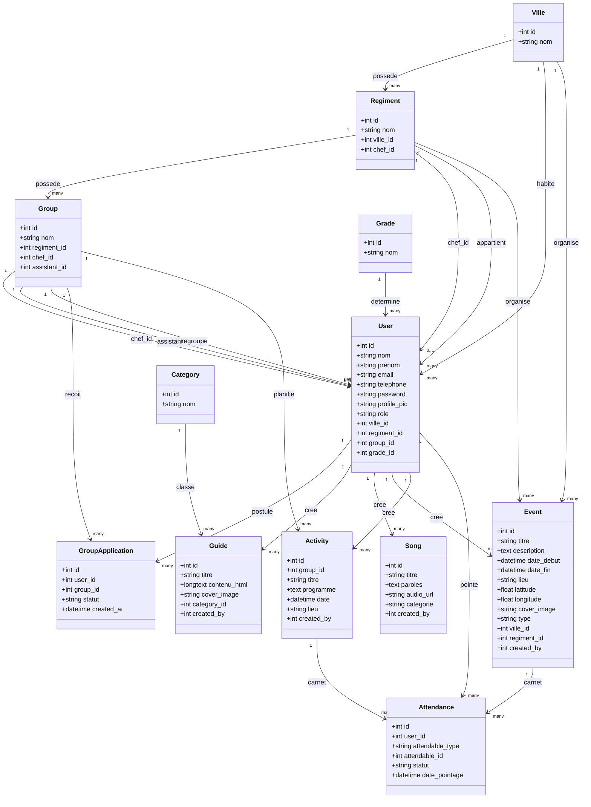

```mermaid
classDiagram
    class Ville {
        +int id
        +string nom
    }

    class Regiment {
        +int id
        +string nom
        +int ville_id
        +int chef_id
    }

    class Group {
        +int id
        +string nom
        +int regiment_id
        +int chef_id
        +int assistant_id
    }

    class Grade {
        +int id
        +string nom
    }

    class User {
        +int id
        +string nom
        +string prenom
        +string email
        +string telephone
        +string password
        +string profile_pic
        +string role
        +int ville_id
        +int regiment_id
        +int group_id
        +int grade_id
    }

    class GroupApplication {
        +int id
        +int user_id
        +int group_id
        +string statut
        +datetime created_at
    }

    class Category {
        +int id
        +string nom
    }

    class Guide {
        +int id
        +string titre
        +longtext contenu_html
        +string cover_image
        +int category_id
        +int created_by
    }

    class Song {
        +int id
        +string titre
        +text paroles
        +string audio_url
        +string categorie
        +int created_by
    }

    class Event {
        +int id
        +string titre
        +text description
        +datetime date_debut
        +datetime date_fin
        +string lieu
        +float latitude
        +float longitude
        +string cover_image
        +string type
        +int ville_id
        +int regiment_id
        +int created_by
    }

    class Activity {
        +int id
        +int group_id
        +string titre
        +text programme
        +datetime date
        +string lieu
        +int created_by
    }

    class Attendance {
        +int id
        +int user_id
        +string attendable_type
        +int attendable_id
        +string statut
        +datetime date_pointage
    }

    Ville "1" --> "many" Regiment : possede
    Regiment "1" --> "many" Group : possede
    Regiment "1" --> "0..1" User : chef_id
    Group "1" --> "0..1" User : chef_id
    Group "1" --> "0..1" User : assistant_id

    Ville "1" --> "many" User : habite
    Regiment "1" --> "many" User : appartient
    Group "1" --> "many" User : regroupe
    Grade "1" --> "many" User : determine

    User "1" --> "many" GroupApplication : postule
    Group "1" --> "many" GroupApplication : recoit

    Category "1" --> "many" Guide : classe
    User "1" --> "many" Guide : cree
    User "1" --> "many" Song : cree

    Ville "1" --> "many" Event : organise
    Regiment "1" --> "many" Event : organise
    User "1" --> "many" Event : cree

    Group "1" --> "many" Activity : planifie
    User "1" --> "many" Activity : cree

    User "1" --> "many" Attendance : pointe
    Event "1" --> "many" Attendance : carnet
    Activity "1" --> "many" Attendance : carnet
```
